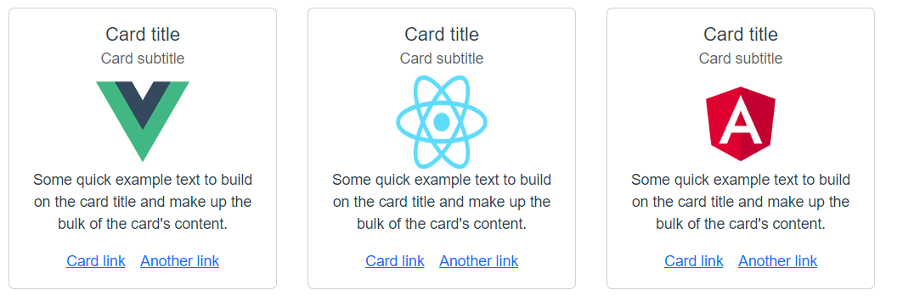

# 00_어떤 프론트엔드 프레임워크가 최고일까?

어떤 프론트엔드 프레임워크가 최고인지 투표를 할 수 있는 간단한 토이 프로젝트

### 시연 영상

 

## 기획

### 기획 의도

Vue 프론트 프레임워크에 대한 연습 및 데이터 전송에 대한 이해

 

### 와이어 프레임

 

### 요구 사항

- 해당 프레임워크 이미지 카드를 눌렀을 때, 실시간으로 투표가 반영되어 데이터 변동이 일어나야함

- 현재 가장 많은 투표를 얻은 프레임워크가 최고라는 것을 보여주어야 하며, 최고 변경 시 반영되어야함

 

### 추가 기능

- Node.js와 Socket.io를 활용하여 실시간으로 사용자들이 간단한 의견을 적어서 보낼 수 있음

 

## 개발 과정

### 이슈

#### 1. img 태그 이미지 절대 경로 :src 바인딩 시 이미지 출력되지 않음

##### 현상

다음 그림처럼 url과 절대 경로가 합쳐져서 바인딩되고 있어 이미지가 출력되지 않음

 

##### 시도1 - require 사용

에러 발생

 

##### [해결] 시도2 - require 사용2

다음과 같이 이미지 경로가 아닌 파일명을 백틱으로 바인딩하고 문자열로 주소를 써주는 방법으로 변경하여 require를 적용함 => 성공

 

#### 2. vote 결과에 따른 데이터가 실시간으로 변경되지 않음

##### 현상

vote를 눌러서 이벤트를 발생시켰고 vuex의 state와 getters에 데이터가 변경되는 것은 확인했으나, 부모 컴포넌트에서 computed의 property값이 변경되지 않은 채로 렌더링되고 있음 

 

##### 원인/이유

reactivity in depth 문제였다.

computed는 '변화를 감지'해서 값을 변경하는 로직이다. 그런데 만약 변화가 감지되지 않는다면??

분명히 vuex의 getters와 state의 값은 변경되고 있다. 그런데 변화가 감지되지 않는다는 게 도대체 무슨 말일까?

 

여기서 vote_state에 주목해보자. vote_state는 배열이다. 지금 현재 위의 로직대로 한다면 특정 경우에 배열의 인덱스 값을 변경하고 있다. **그러나 vote_state 자체는 배열로서 변화된 것이 아무것도 없다. 즉, Vuex는 현재 vote_state에만 주목을 하고 있지, vote_state의 내부에 있는 인덱스 값의 변경에는 신경을 쓰지 않고 있다.**  위의 예시처럼 로직을 설정한다면 vote_state 내부에 있는 값만 변경되고 있지 vote_state 자체가 변경되는 것이 아니기 때문에 vuex는 vote_state에 대한 변화가 없다고 인지하고 있는 것이다.

##### 해결

new_vote_state에 현재 vote_state의 값을 저장한 뒤에, state.vote_state를 빈 배열로 선언한다. 이때 vuex는 vote_state가 변경되었음을 감지한다. 그리고 state.vote_state에 new_vote_state값을 넣어줌으로써 state.vote_state를 우리가 원하는 로직대로 변경하고 vuex에서 변화를 감지하게 하는 것이다.(빈 배열에서 새로운 값으로 변화를 감지한 것임)

 

## 토이 프로젝트 후기

### 느낀점

역시나 CSS가 너무나도 약하다. CSS를 참고하지 않고 스스로 어느정도만 할 수 있어도 개발 시간을 훨씬 단축시킬 수 있을 것 같다

### 배운점

#### 1. vuex와 computed property

vuex에서 변화를 감지한다는 것의 의미가 무엇인지 알게되었다. 단순히 값이 변경된다고 해서 변화를 감지하는 것이 아니라는 것을 배웠다.

 

#### 2. isNaN function

어떤 변수 값이 NaN인지 확인하기 위해서는 `000 === NaN` 보다는 isNaN 함수를 쓰는 것이 좋다

 

#### 3. computed 속성 CSS 스타일 적용

지난번 영화 관통 프로젝트 제작 시 computed 속성을 CSS 스타일링에 활용했었다. 해당 코드를 다시 보니 불필요한 중복을 반복하고 있어서 이번에는 computed 속성을 몇 개 더 만들지 않고 그냥 바로 해당 computed 속성을 CSS스타일링에 직접 적용했다.

